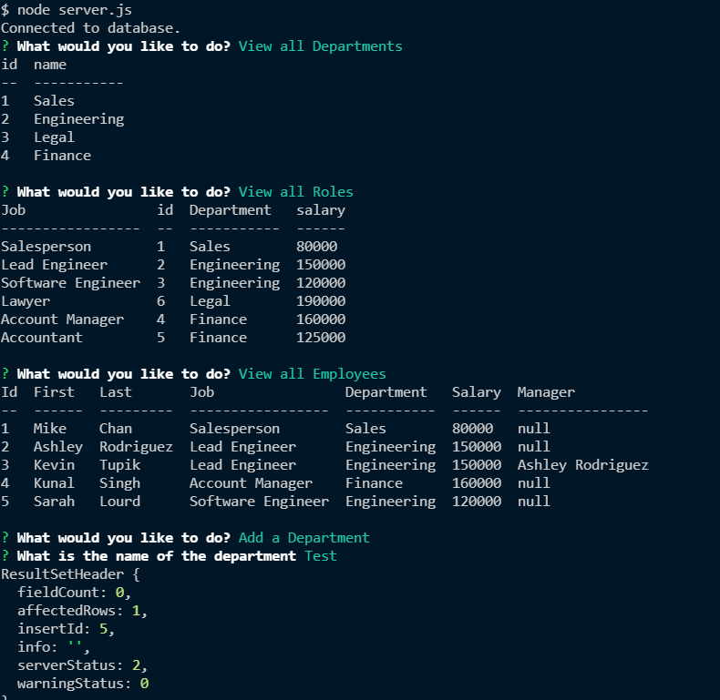

# employeeTracker

# noteTaker

## Description

An app that allows the user to update a mysql db via command line prompts

## Table of Contents

- [License](#license)
- [Installation](#installation)
- [Usage](#usage)
- [Contributing](#contributing)
- [Tests](#tests)
- [Questions](#questions)

## License

This project is licensed under GPL3.0. For more information please see [the liscense page](https://choosealicense.com/licenses/gpl-3.0/)

## Installation

To install necessary dependencies, run the following command: npm i

## Usage

Please see screenshot of deployed app below:

Please see the video link below:
[Video](https://drive.google.com/file/d/1C-IVeU2GZKed-8GN0az8UCgM6sHhu_j4/view)

## Contributing

If you would like to contribute please email me at the address below

## Tests

No tests currently available

## Questions

Please reach out with any questions at:  
GitHub: [bhodge166](https://github.com/bhodge166) 
Email: bhodge166@gmail.com
